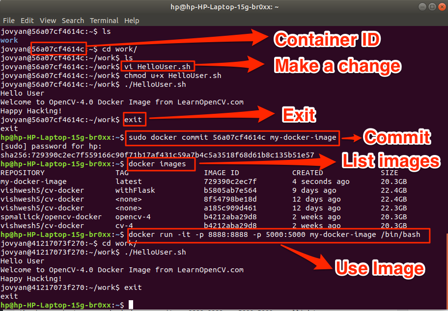

# 　　　　　　Docker使用经验

**本文总结了Kaggle比赛常用的kaggle命令备查**

### 使用经验

#### **1. 在Ubuntu上安装Docker**

Step 1. add the GPG key for the official Docker repository to the system

  `curl -fsSL https://download.docker.com/linux/ubuntu/gpg | sudo apt-key add -`

Step 2. Add the Docker repository to APT sources

`sudo add-apt-repository "deb [arch=amd64] https://download.docker.com/linux/ubuntu $(lsb_release -cs) stable"`

Step 3. update the package database with the Docker packages from the newly added repo

`sudo apt-get update`

Step 4. Make sure you are about to install from the Docker repo instead of the default Ubuntu 16.04 repo

`apt-cache policy docker-ce`

Step 5. You should see output similar to the following:

```
docker-ce:
  Installed: (none)
  Candidate: 17.03.1~ce-0~ubuntu-xenial
  Version table:
     17.03.1~ce-0~ubuntu-xenial 500
        500 https://download.docker.com/linux/ubuntu xenial/stable amd64 Packages
     17.03.0~ce-0~ubuntu-xenial 500
        500 https://download.docker.com/linux/ubuntu xenial/stable amd64 Packages
```

Step 6. install Docker

`sudo apt-get install -y docker-ce`

#### **2. 安装Docker OpenCV Image**

注意，docker image默认不支持X11转发，需要自己做映射

  Step 1. 下载/更新Docker image

`docker pull spmallick/opencv-docker:opencv`

  Step 2.  跑起来

`docker run --device=/dev/video0:/dev/video0 -v /tmp/.X11-unix:/tmp/.X11-unix -e DISPLAY=$DISPLAY -p 5000:5000 -p 8888:8888 -it spmallick/opencv-docker:opencv /bin/bash`

关于上面命令一些选项的注释：

-  **–device=/dev/video0:/dev/video0** allows use of webcam
-  **-v /tmp/.X11-unix:/tmp/.X11-unix** helps in X11 forwarding so that we can use functions like **cv::imshow**.
-  **-e** is used to pass an environment variable.
-  **-it** starts an interactive session
-  **-p** sets up a port forward. This flag maps the container’s port to a port on the host system.
-  **/bin/bash** runs **.bashrc** file on startup

#### **3. 提交对Docker Image的修改**

默认在Docker容器内的修改是不会保存在Docker image里面的，需要自己如下图所示Commit一下：



#### **4.**


### 参考资料

[Install OpenCV Docker Image on Ubuntu,  MacOS  or Windows](https://www.learnopencv.com/install-opencv-docker-image-ubuntu-macos-windows/)
